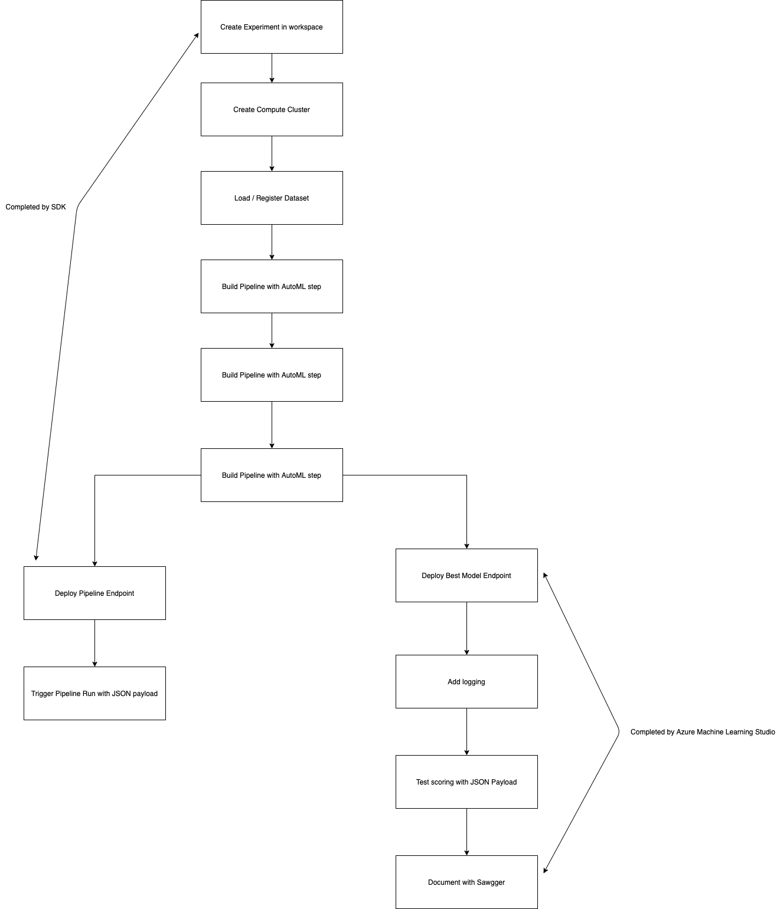
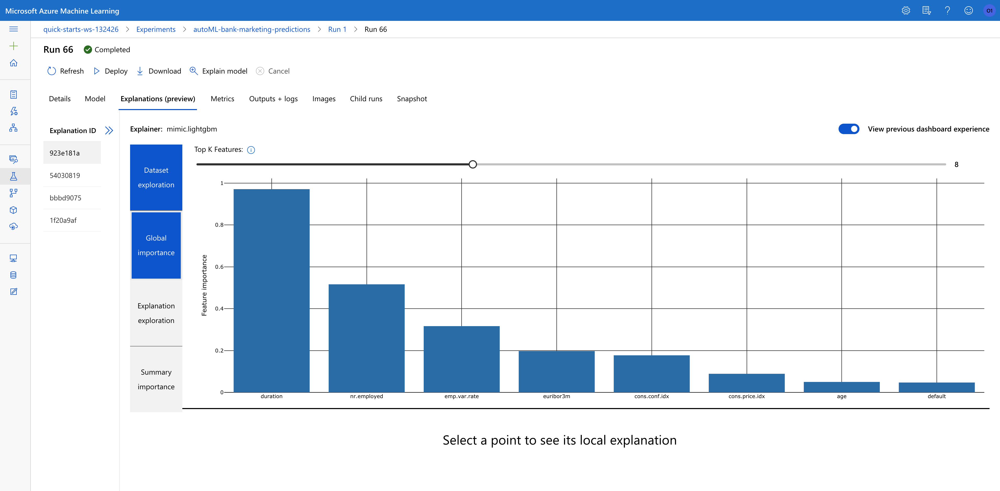
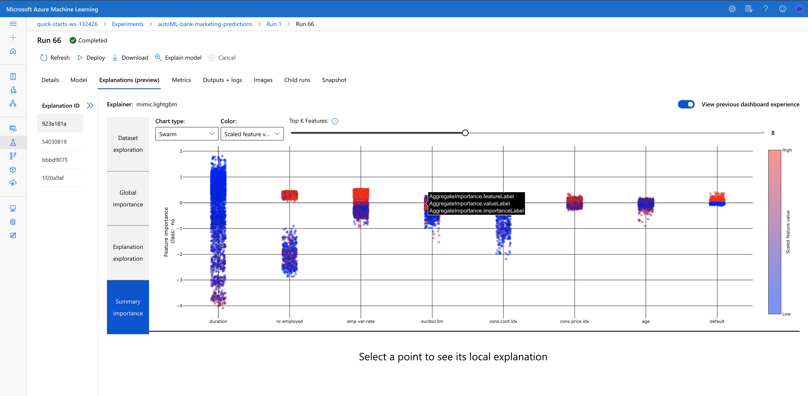
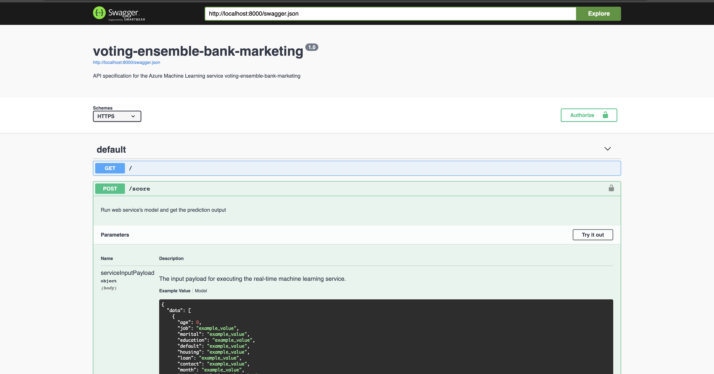
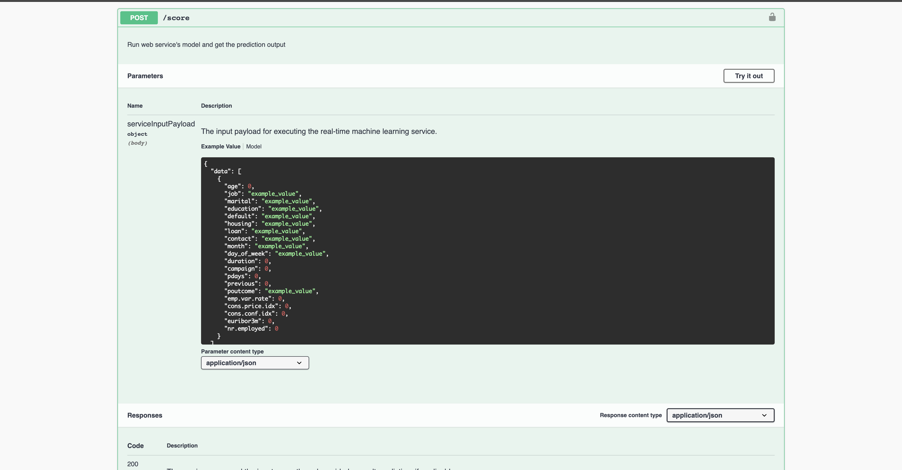
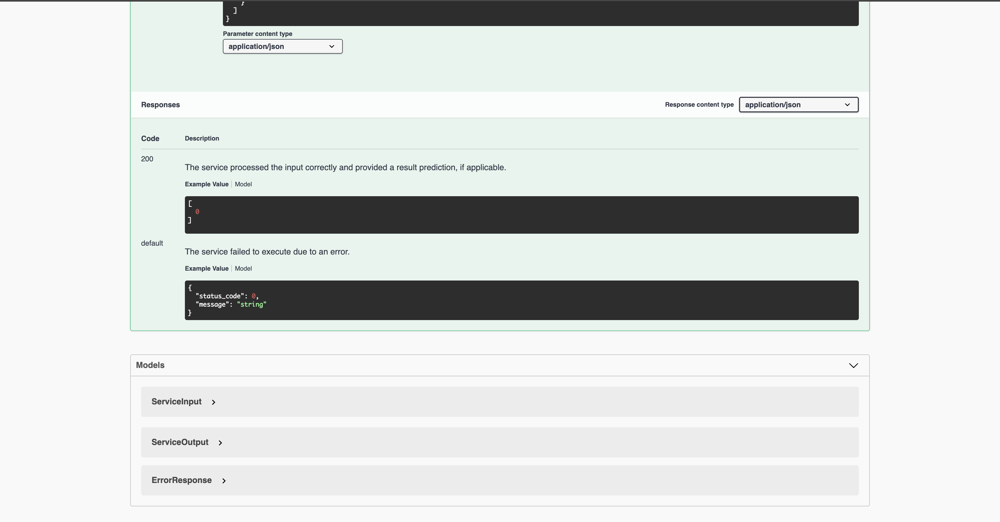

# Opreationalizing Machine Learning with Azure

## Project Overview

In this project, we will use the hybrid of Azure Machine Learning SDK and Azure Machine Learning Studio's webUI. We will start by creating an autoML experiment on the bank marketing prediction dataset and let Azure ML pick the best model for us. Then we will publish the pipeline as an endpoint, which will allow us to trigger the same AutoML experiment through JSON payloads. We will then deploy the best model as a webservice endpoint, add retrieve the endpoint's logging, while also benchmark the endpoint. Finally we will utilize swagger to effectively visualize the API endpoint's request and response for better standardization purposes.

## Architectural Diagram



## Key Steps

The general process of operationalizing machine learning on Azure is the following 

1. Create an `Experiment` in an existing `Workspace`.
2. Create or Attach existing AmlCompute to a workspace.
3. Define data loading in a `TabularDataset`.
4. Configure AutoML using `AutoMLConfig`.
5. Configure AutoMLStep
6. Train the model using AmlCompute
7. Explore the results.
8. Test the best fitted model.
9. Publish the pipeline to a REST Endpoint
10. Trigger the pipeline run with a JSON payload
11. Deploy the best performing model from AutoML as a webservice
12. Add logging to the deployed webservice Endpoint
13. Check the Swagger documentation for the webservice endpoint
14. Benchmark the webservice endpoint

(step 1, 2) We will start with the standard steps by creating an experiment in the workspace and setting up the compute cluster in the workpace by running the following lines of code for the Azure SDK

```python

ws = Workspace.from_config()
print(ws.name, ws.resource_group, ws.location, ws.subscription_id, sep="\n")


experiment_name = "bank-marketing-prediction-automl"
experiment = Experiment(ws, experiment_name)

# Choose a name for your CPU cluster
amlcompute_cluster_name = "automl-compute"

# Verify that cluster does not exist already
try:
    compute_target = ComputeTarget(workspace=ws, name=amlcompute_cluster_name)
    print("Found existing cluster, use it.")
except ComputeTargetException:
    compute_config = AmlCompute.provisioning_configuration(
        vm_size="STANDARD_D2_V2",  # for GPU, use "STANDARD_NC6" 
        max_nodes=4,
    )
    compute_target = ComputeTarget.create(ws, amlcompute_cluster_name, compute_config)
```

We can verify in the workspace the correct resources are created

Experiment (shown as completed)


(step 3) We will then load in the data by running the following lines from the SDK

```python
found = False
key = "Bank-marketing"
description_text = "Bank Marketing DataSet for Udacity Course 2"

if key in ws.datasets.keys():
    print("Found existing dataset, using")
    found = True
    dataset = ws.datasets[key]

if not found:
    # Create AML Dataset and register it into Workspace
    print(f"Did not find existing dataset with key {key}, creating")
    example_data = "https://automlsamplenotebookdata.blob.core.windows.net/automl-sample-notebook-data/bankmarketing_train.csv"
    dataset = Dataset.Tabular.from_delimited_files(example_data)
    # Register Dataset in Workspace
    dataset = dataset.register(workspace=ws, name=key, description=description_text)
```
This will load in the dataset if it's already in the workspace, otherwise it will create the dataset from that linked datasource
Let's verify if it has been suceessfully created


(step 4, 5) We can then proceed to creating the configurations of the AutoML pipeline. Start by running the following lines in the SDK

```python
automl_settings = {
    "experiment_timeout_minutes": 20,
    "max_concurrent_iterations": 4,
    "primary_metric": "AUC_weighted",
}
automl_config = AutoMLConfig(
    compute_target=compute_target,
    task="classification",
    training_data=dataset,
    label_column_name="y",
    path=project_folder,
    enable_early_stopping=True,
    featurization="auto",
    debug_log="automl_errors.log",
    model_explainability=True,
    **automl_settings
)

# define outputs
ds = ws.get_default_datastore()
metrics_output_name = "metrics_output"
best_model_output_name = "best_model_output"

metrics_data = PipelineData(
    name="metrics_data",
    datastore=ds,
    pipeline_output_name=metrics_output_name,
    training_output=TrainingOutput(type="Metrics"),
)
model_data = PipelineData(
    name="model_data",
    datastore=ds,
    pipeline_output_name=best_model_output_name,
    training_output=TrainingOutput(type="Model"),
)

# create AutoML step
automl_step = AutoMLStep(
    name="automl_module",
    automl_config=automl_config,
    outputs=[metrics_data, model_data],
    allow_reuse=True,
)

# create pipeline
pipeline = Pipeline(
    description="pipeline_with_automlstep", workspace=ws, steps=[automl_step]
)
```

(step 6) We can submit the pipeline for execution 

```python
pipeline_run = experiment.submit(pipeline)
```

Let's quickly verify the completion of the pipeline we just submitted


Also taking a look at the best model produced by AutoML


(step 7, 8) We can also explore the results for the autoML run in the notebook

One interesting thing to look like is the explanation for the best model. The following screenshot shows the importance of each feature



Here is another one, this visualization shows the range of the value that could contribute to model predicting a certain class



(step 9) Next we will proceed to publishing the pipeline as an endpoint. This could be accomplished by the following commands 

```python

published_pipeline = pipeline_run.publish_pipeline(
    name="Bankmarketing Train", description="Training bankmarketing pipeline", version="1.0") 
```

We will also retrieve the authentication header so the pipeline endpoint can be used

```python
interactive_auth = InteractiveLoginAuthentication()
auth_header = interactive_auth.get_authentication_header()
```

We can verify if the pipeline endpoint is indeed created


(step 10) This endpoint could be consumed using JSON payload, which will trigger another scheduled AutoML run

```python
# retrieve the endpoint URI
rest_endpoint = published_pipeline.endpoint
# post a request to the endpoint
response = requests.post(rest_endpoint, 
                         headers=auth_header, 
                         json={"ExperimentName": "pipeline-rest-endpoint"}
                        )
```
This will trigger another identical AutoML run, we can quickly verify that (shown as completed as well)


(step 11) We will also deploy the best model as a web service. This could be easily accomplished by clicking the "Deploy" button 

We can see now the best model has been deployed as a web service


At the same time, since we have enabled application insights, the logging URL is also provided

(step 12) We can also mannually trigger the logging to be enabled by running the file `logs.py`. The file will enable logging (from the below line) and print out the logs in the terminal 

```python
service.update(enable_app_insights=True)
```

The logs printed looks like the following


Once deployed, the endpoint could be consumed by sending through some sample payloads. We will create an `endpoint.py` file that contains 2 sample datapoints

```python
data = {
    "data": [
        {
            "age": 17,
            "campaign": 1,
            "cons.conf.idx": -46.2,
            "cons.price.idx": 92.893,
            "contact": "cellular",
            "day_of_week": "mon",
            "default": "no",
            "duration": 971,
            "education": "university.degree",
            "emp.var.rate": -1.8,
            "euribor3m": 1.299,
            "housing": "yes",
            "job": "blue-collar",
            "loan": "yes",
            "marital": "married",
            "month": "may",
            "nr.employed": 5099.1,
            "pdays": 999,
            "poutcome": "failure",
            "previous": 1,
        },
        {
            "age": 87,
            "campaign": 1,
            "cons.conf.idx": -46.2,
            "cons.price.idx": 92.893,
            "contact": "cellular",
            "day_of_week": "mon",
            "default": "no",
            "duration": 471,
            "education": "university.degree",
            "emp.var.rate": -1.8,
            "euribor3m": 1.299,
            "housing": "yes",
            "job": "blue-collar",
            "loan": "yes",
            "marital": "married",
            "month": "may",
            "nr.employed": 5099.1,
            "pdays": 999,
            "poutcome": "failure",
            "previous": 1,
        },
    ]
}
# Convert to JSON string
input_data = json.dumps(data)
with open("data.json", "w") as _f:
    _f.write(input_data)

# Set the content type
headers = {"Content-Type": "application/json"}
# If authentication is enabled, set the authorization header
headers["Authorization"] = f"Bearer {key}"

# Make the request and display the response
resp = requests.post(scoring_uri, input_data, headers=headers)
print(resp.json())
```

If the endpoint is fully functional, the response will directly show whether the customer is likely to subscribe a term deposit in the future


(step 13) Swagger provided a simple way to understand the request and response format of the API. Azure ML provided a `swagger.json` file that allow us to run a swagger server in our local environment. On two separate terminal windows, we can run the `serve.py` and `swagger.sh` file, which allow us access swagger with our local host. We can then type in "https://localhost" into our browser, then swagger server will be loaded up. Then we will replace the default url with `http://localhost:8000/swagger.json` to view our API's documentation

The swagger server looks like the following,



Our API's request and response format looks like the following

Request



Response



(Step 14 optional) We can also use apache's benchmark functionality to view if our API is having any irregularities

We can type in the following command in the terminal

``` ab -n 10 -v 4 -p data.json -T 'application/json' -H 'Authorization: Bearer PRIMARY_KEY' SCORE_URI```

(remember to replace key and scoring URI)

Then the benchmark stats will shown in the terminal which looks like the following


All of the steps could be viewd in the jupyter notebook.

## Screen Recording
You can watch a screencast demo from the link [here](https://youtu.be/nu0YWzkXIos) ~ 6 min

## Standout Suggestions
* getting the terminal commands into the jupyter notebook for better visualization purposes. 
* obtain sensitive information (API URI and primary key) dynamically from code
* Attempt to deploy the best model to ACI (wasn't successful)